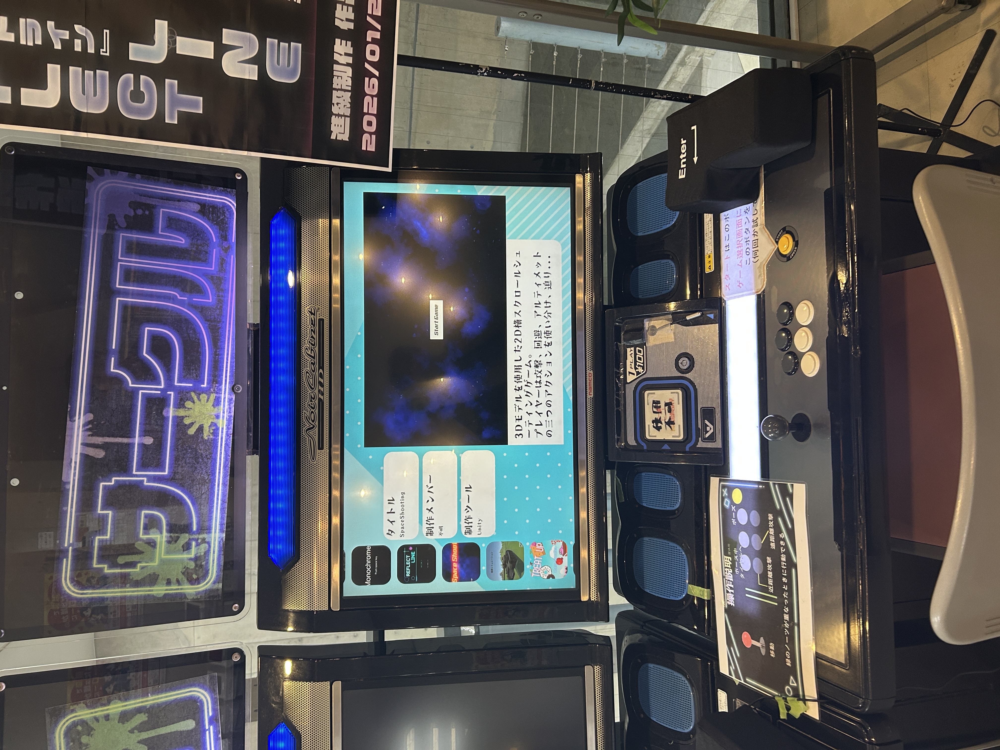

# ゲームランチャー

学校のゲーム展示用に開発したゲームランチャーです。ゲーム情報をINIファイルで管理することで、新しいゲームをソースコードを変更せずに追加できる設計を採用しています。

# 展示の様子
<p align="center">
  
</p>

---

## プレビュー動画

[](https://youtu.be/IACK7Nox_8k)

---

## 主な機能

### 設定ファイルの自動生成

- アプリケーション起動時に`config.ini`が存在しない場合、自動で生成します。
- 各ゲームフォルダ内に`launcher_info.ini`が存在しない場合も自動生成します。

<details>
<summary>ディレクトリ構成</summary>

```text
OHOLauncher/
├─Launcher.exe
├─config.ini
├─data
│  ├─fonts
│  ├─GameData
│  └─image
└─Intermediate
```

</details>

---

### INIファイルによる設定管理

ランチャーの設定やゲーム情報をINIファイルで管理しています。

#### `config.ini`

- ウィンドウサイズ
- フルスクリーン／ウィンドウ表示
- フレームレス表示
- 放置判定時間

#### `launcher_info.ini`

- ゲームタイトル
- アイコン画像
- 紹介動画
- ゲーム説明
- 制作スタッフ
- 使用ツール
- ジャンル
- 表示優先度
- 実行ファイル
- 制作年度

ゲームを追加する際は、ゲームフォルダと`launcher_info.ini`を配置するだけで登録できます。

---

### ランチャーの機能

- ゲーム一覧表示
- 紹介動画の再生
- ゲーム情報の表示
- 表示優先度による並び替え
- 一定時間操作がない場合は紹介動画の音声をミュート
- ゲーム起動後、一定時間経過すると自動でランチャーへ復帰

---

## 工夫した点

### ゲーム追加を容易にする設計

ゲーム情報をコードへ直接記述せず、INIファイルから読み込む構成にすることで、新しいゲームを追加する際にソースコードを変更する必要がない設計にしました。

### 初回起動時のセットアップを自動化

必要な設定ファイルが存在しない場合は自動生成することで、利用者が手動で設定ファイルを作成する必要がないようにしました。

### 展示利用を想定した機能

学校のゲーム展示での利用を想定し、

- 放置時の音声ミュート
- ゲーム終了後のランチャー自動復帰

など、運用しやすい機能を実装しています。

---

## `launcher_info.ini` の設定項目

|項目|説明|
|---|---|
|title|ゲームタイトル|
|image|アイコン画像|
|movie|紹介動画|
|desc|ゲーム説明（`\n`で改行可能）|
|staff|制作スタッフ（`\n`で改行可能）|
|tools|使用ツール|
|genre|ジャンル（`,`区切りで複数指定可能）|
|priority|表示優先度（数値が大きいほど上位表示）|
|path|起動する実行ファイル名|
|year|制作年度（西暦）|

---

## `config.ini` の設定項目

|項目|説明|
|---|---|
|width|ウィンドウ幅|
|height|ウィンドウ高さ|
|Fullscreen|1：フルスクリーン、0：ウィンドウ|
|Frameless|1：フレームレス、0：通常ウィンドウ|
|AppLeaveTime|アプリ起動後の放置判定時間（秒）|
|AudioLeaveTime|ゲーム選択画面での放置判定時間（秒）|

---

## 開発環境

- Windows 11
- C++
- OpenSiv3D 0.6.16
- Visual Studio 2022

---

## 今後の改善予定

- ジャンル数・ジャンル名が増えた場合でも崩れないUIへの改善
- 制作年度によるソート機能の追加
- ゲーム一覧切り替え時の入力処理の改善
- ゲーム数増加時の起動速度改善（キャッシュ機能などを検討）
- ウィンドウサイズ変更時のUIレイアウト最適化
